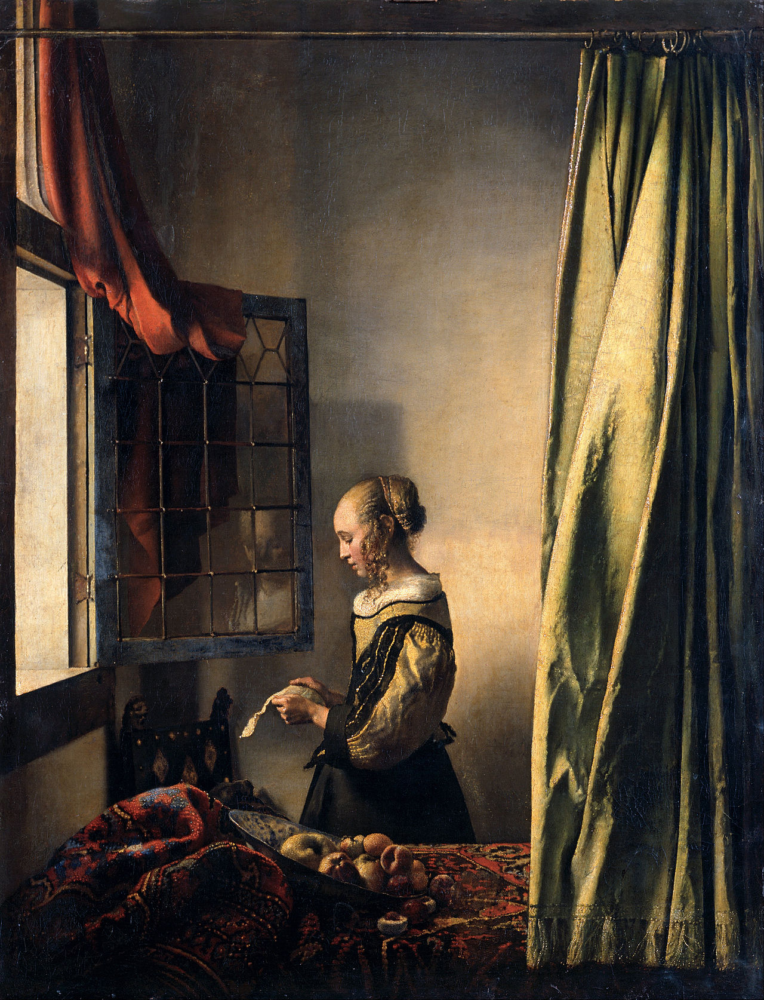

==========================
Cryptography for Engineers
==========================

Introduction
============

Story
-----

..
	Hook -- tale of war secret

Goals
-----

.. container:: item-incremental

	- What engineers should know about pre-modern cryptography

	- Fundamentals of public key cryptography

	- 

..
	Public key encryption
	- diffie hellman key exchange
	- was classified information by british govt

	goals of this talk
	- learn the origins, basics, and uses of public key encryption

What is cryptography?
---------------------

.. container:: compare

	.. container:: one-incremental

		`kryptos`
		[hidden]

	.. container:: one-incremental

		`graphein`
		[to write]

.. container:: one-incremental

	Related: *Cryptanalysis*

..
	secrets
	hiding something in plainview
	passing messages from one trusted party to another
	not unlike locking something with a key

	related: Cryptanalysis

Early Cryptography
------------------

.. image:: treasure.jpg

..
	Steganography
	-------------
	innovative methods of hiding messages
	hide it javelin, on someone's head(shave to read)
	message travels in the clear-- but someone has to know how to read
	what was secret = method of hiding

	Encryption
	----------
	actually changing the text.
	what was secret = method of changing text = key

Keys
----

.. container:: one-incremental

  T Y R W C A F G E F Q E T U O     # FIXME

.. container:: one-incremental

  B I R D B I R D B I R D B I R

.. container:: one-incremental 

  M E E T M E A T T H E C A F E

..
	encrypted message travels-- if enemy finds it, it means nothing without the key
	key could be a literal lock/key
	or a means of translating the original message to the plaintext-- un-encrypted

Key Examples
------------

"Skip every 5th letter"

"Skip 5 letters [take letter] 
 4 letters [take letter]
 3 letters [take letter] 
 ... start over at 1"

	
..

	Caesar Cypher
	-------------

	Key is BIRD

	A B C D E F G H I J  K  L  M  N  O  P  Q  R  S  T  U  V  W  X  Y  Z
	1 2 3 4 5 6 7 8 9 10 11 12 13 14 15 16 17 18 19 20 21 22 23 24 25 26

	B = 2
	I = 9
	R = 18
	D = 4

	Message to encrypt:
	attack at dawn

	   a  t  t  a  c  k  a  t  d  a  w  n
	+  B  I  R  D  B  I  R  D  B  I  R  D 
	-------------------------------------
	   C  C  L  E  E  T  [Fill in the rest!]

Early Ciphers
-------------

- Caesar

- Vignere

- One Time Pads

Shared Secrets
--------------

"the secret word is BIRD"

Symmetric Cryptography
---------------------

Sender (encrypter) and receiver MUST have the key

[insert pretty picture of symmtrical key relationship]

..
	AES
	---

Asymetric Crypto
----------------

Key never travels in the clear
Murmurings about this in 1800s

Public Key Cryptography
=======================

The Beauty of Public Key Cryptography
-------------------------------------

- I can send a secret message that only one person can read.
- Someone can send me a message that only I can read.

- I can send a message that anyone could read, but is provably sent by me.
- Someone can send a message that anyone could read, but is provably sent by them.

[Key Never Needs to be Transferred or Communicated]

How?
----

Public and Private Keys

Something encrypted with a public key can ONLY be decrypted with the Private Key

Something encryted with a private key can ONLY be decrypted with Public Key

PyCrypto
--------

Python encryption lib.

Let's Practice Public Key Encryption
------------------------------------

1. Make a key pair

`ssh-keygen`

`key.pub`, `key`

2. Encrypt something with my private key, prove I wrote it 
  (Audience should decrypt with my public key)
3. Encrypt something with someone else's public key
   (Someone should decrypt with their private key)

Other Uses of PyCrypto
----------------------

Hashing
Random number generation

Applied Public Key Crpyto
=========================

1. HTTPS
2. SSH
3. OAuth
4. Blockchain

Conclusion
==========

The Code Book is great further study.
Cryptography is fun!

