======================================
Getting Started with Class-Based Views
======================================

.. TODO
  what of CBVs are in Django tutorial?

..
  how to start using CBVs
  how they work
  how to break them down for your use case

.. 
  CBVs: 
   - DRY up code
   - Encourage consistency in form valid
   - Plug right into model classes
  
  Making full use?

  1. Replace function based view for homepage with a CBV using TemplateView

  2. ListView
    - purpose
    - descendants 
    - possibilities

  3. Debunk myth that classbased views are only for model pages.
    - can be elegant for multiple database components

.. DONT FORGET audience q's
  love python?
  love pybay?
  exp with flask?
  exp with any kind of django, including tutorial?
  exp with object orientation?
     

Intro
=====

What I'll Cover
---------------

- Briefly: why CBVs

- **TemplateView**, **ListView**, **DetailView**

- A custom mixin

- Tips/resources

Some assumptions
----------------

- You've created a dynamic web application

.. container:: nest-incremental

  - You've created your own objects in Python

  - You've looked at the Django tutorial

    ::

      project (root)
      |   manage.py
      |
      |---- project
      |    |  urls.py
      |    |  settings.py
      |
      |----- goats
      |    | models.py
      |    | urls.py
      |    | views.py
      ____________________

Disambiguation
--------------

Class-Based Views can refer to

.. container:: nest-incremental

  - Subclassing Django's **generic** class-based views

    - ``CreateView``, ``UpdateView``

    - Django's generic mixins such as ``LoginRequired``

  - Custom views that you create using the base ``View`` class

    - Your own mixins ``RandomGoatFactMixin``

    - Non-generic hierarchical views

.. newslide::

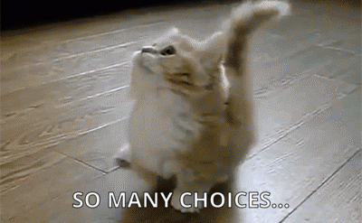

Why Class-Based Views
=====================

What is a view?
---------------

.. container:: one-incremental

  A user

  - Clicked on a link

  - Typed a URL and pressed Enter

  - Submitted a form

.. container:: nest-incremental

  - But also

    - Javascript asked for some data

.. speaker note

  wont be talking about that today, but see resources at end.

A Response
----------

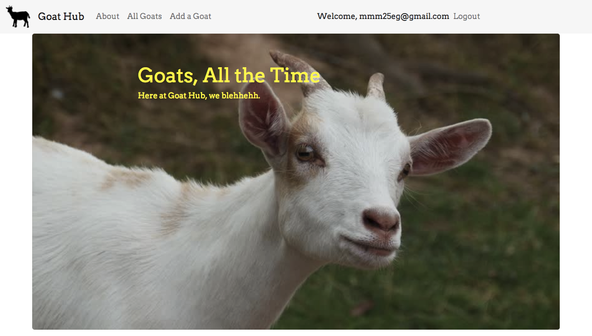

.. speaker note

  GOATHUB-- not version control for goats, (wish I built that)
  It's more like pinterest for goats

Function-Based Views in Django
------------------------------

.. FIXME ?? maybe, if time.

**project/goats/views.py**

.. code-block:: python

  def show_homepage(request):
      return render(request, 'goats/homepage.html')

**project/goats/urls.py**

.. code-block:: python

  from goats import views

  urlpatterns = [

      # ...
      url(r'^fbv/$', views.show_homepage, name='fbv'),

  ]

Function-Based Views
--------------------

- Pro: Easy to get started

- Pro: Plug nicely into Django's APIs

.. container:: one-incremental

  - Con: Limited expressiveness

Limited Expressiveness
----------------------

**zulip/zerver/views/report.py**

.. code-block:: python

  @authenticated_json_post_view
  @has_request_variables
  def json_report_send_time(request, user_profile,
                            time=REQ(converter=to_non_negative_int),
                            received=REQ(converter=to_non_negative_int,
                                default="(unknown)"),
                            displayed=REQ(converter=to_non_negative_int,
                                default="(unknown)"),
                            locally_echoed=REQ(validator=check_bool,
                                default=False),
                            rendered_content_disparity=REQ(validator=check_bool,
                                default=False)):
      # type: (HttpRequest, UserProfile, int, int, int, bool, bool) -> HttpResponse
      request._log_data["extra"] = "[%sms/%sms/%sms/echo:%s/diff:%s]" \
          % (time, received, displayed, locally_echoed, rendered_content_disparity)
      base_key = statsd_key(user_profile.realm.string_id, clean_periods=True)
      statsd.timing("endtoend.send_time.%s" % (base_key,), time)
      if received != "(unknown)":
          statsd.timing("endtoend.receive_time.%s" % (base_key,), received)
      if displayed != "(unknown)":
          statsd.timing("endtoend.displayed_time.%s" % (base_key,), displayed)
      if locally_echoed:
          statsd.incr('locally_echoed')
      if rendered_content_disparity:
          statsd.incr('render_disparity')
      return json_success()

Function-Based View in Flask
----------------------------

.. code-block:: python

  @app.route('/registration_saved', methods = ["POST"])
  def after_register():
      #update the user's profile
      u = Author.query.filter_by(id = g.user.id).first()
      if u is None:
          flash('Invalid registration.\
                 Please enter a valid department ID.')
          return redirect(url_for('register'))
      d = request.form["department_id"]
      department_check = Department.query \
                             .filter_by(department_key = d) \
                             .first()
      if department_check is None:
          flash("Department not found.")
          return redirect(url_for('register'))
      else:
          u.username = request.form["username"]
          u.user_department = department_check.id
          u.subject = request.form["subject"]
          db.session.add(u)
          db.session.commit()
          return redirect(url_for('index'))

Why Class-Based Views
---------------------

.. container:: nest-incremental

  - Hide complexity

    - Even *more* than what a function hides

  - Each view should express the essential features of **only** that view

    - Not what's *generic* about that view

  - Views that are similar, but different, should still behave similarly

.. newslide::

The Simplest CBV
================

Function-Based Homepage View
----------------------------

.. code-block:: python

  def show_homepage(request):
      return render(request, 'goats/homepage.html')

Let's make it a CBV
-------------------

.. code-block:: python

  class HomepageView(generic.TemplateView):
      """The homepage of the site."""

      template_name = "goats/homepage.html"

Ancestors of TemplateView
-------------------------

.. container:: nest-incremental

  - ``TemplateResponseMixin``

     - "I know how to make a response using a given template"

  - ``ContextMixin``

     - "I can make a dictionary that will get passed to a template"

  - ``View``

     - "I can be assigned to a URL and accept certain HTTP methods"

.. newslide::

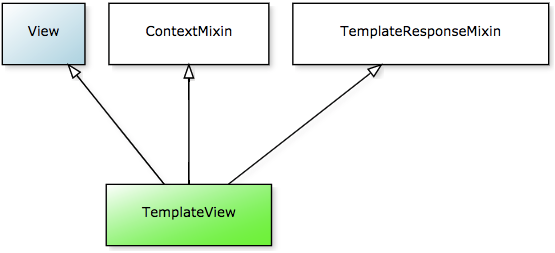

`Source <https://ccbv.co.uk/`_

Open Source Example: TemplateView
---------------------------------

**zulip/corporate/urls.py**

.. code-block:: python

  from django.conf.urls import url
  from django.views.generic import TemplateView, RedirectView

  i18n_urlpatterns = [
      # Zephyr/MIT
      url(r'^zephyr/$',
          TemplateView.as_view(
              template_name='corporate/zephyr.html')
      ),
      url(r'^zephyr-mirror/$',
          TemplateView.as_view(
              template_name='corporate/zephyr-mirror.html')
      ),
  ]

Conclusion: TemplateView
------------------------

ListView
========

In the wild
-----------

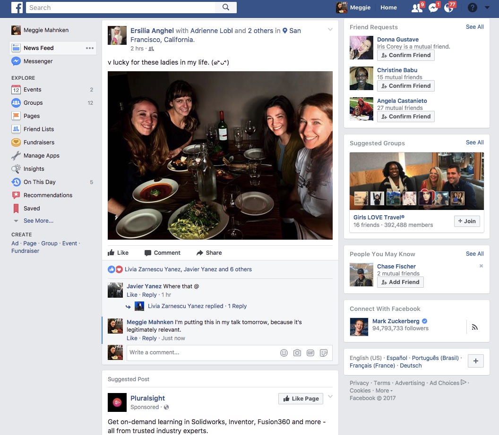

.. newslide::

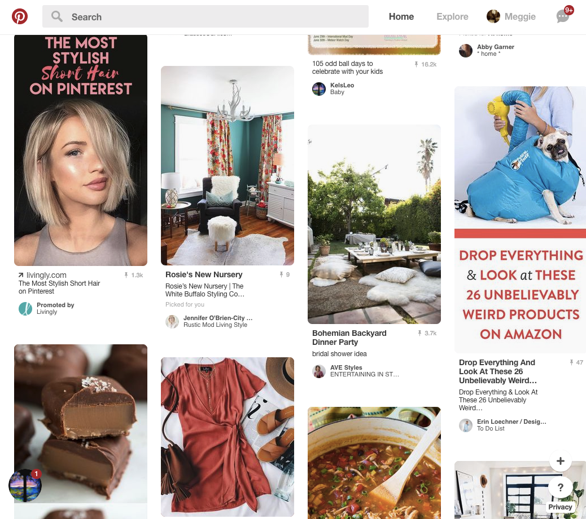

Remember?
---------

.. container:: nest-incremental

  - Each view should express the essential features of **only** that view

    - Not what's *generic* about that view

The Simplest ListView
---------------------

**project/goats/views.py**

.. code-block:: python

  from django.views import generic
  from .models import Goat

  class GoatListView(generic.ListView):
      """See all goats."""

      model = Goat
      template_name = "goats/goats_list.html"

**project/goats/urls.py**

.. code-block:: python

  from django.conf.urls import url
  from goats import views

  urlpatterns = [

      # ...
      url(r'^goat/all/$', views.GoatListView.as_view(),
          name="goats_list"
      ),
  ]

.. newslide::

**project/goats/models.py**

.. code-block:: python

  from django.db import models
  from django.contrib.auth.models import User

  class Goat(models.Model):
      """A goat. """

      user = models.ForeignKey(
          User,
          null=False,
      )

      name = models.CharField(
          max_length=40,
      )

      photo = models.ImageField(
          upload_to="goats",
          blank=True,
      )

      description = models.TextField(
          blank=True,
          help_text="Additional information about this goat."
      )

.. newslide::

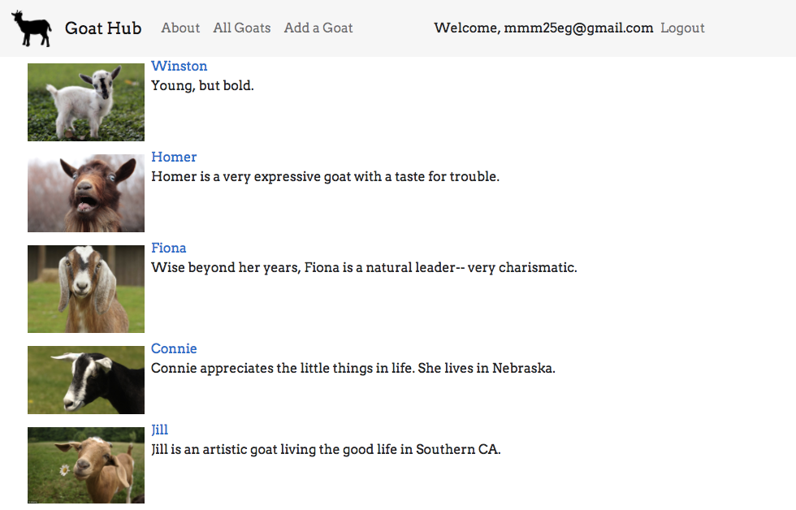

Same logic, different template
------------------------------

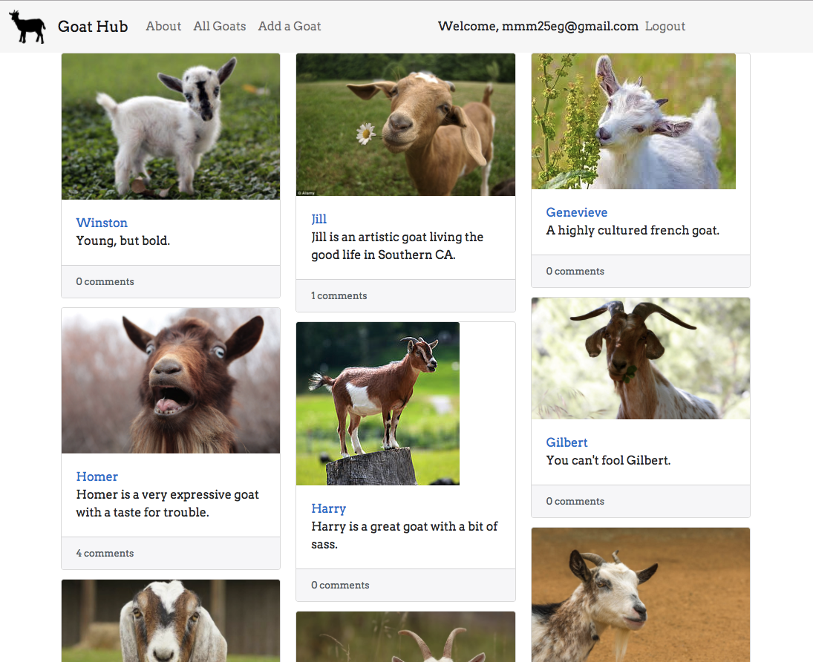

.. newslide::

**project/goats/views.py**

.. code-block:: python

  from django.views import generic

  class GoatListView(generic.ListView):
      """See all goats."""

      model = Goat

      def get_template_names(self):
          format = self.request.GET.get('format')
          if format == 'pinterest':
              return ['goats/goat_list_pinterest.html']
          else:
              return ['goats/goats_list.html']

.. no time for JSON explanation

  Same logic, different response type
  -----------------------------------

  FIXME pic

  .. newslide::

  FIXME codez

ListView Ancestors
------------------

.. container:: nest-incremental

  - ``MultipleObjectTemplateResponseMixin`` and ``TemplateResponseMixin``

      - "I know how to make a response using a given template, and have a default name if the template is for a ListView"

  - ``BaseListView``

      - "I am a view with multiple objects"

.. newslide::

.. container:: nest-incremental

  - ``MultipleObjectMixin``

      - "Give me the name of a database table and query it appropriately for your view, and put the results into the
        template you specify"

  - ``View``

       - "I can be assigned to a URL and accept certain HTTP methods"

.. newslide::

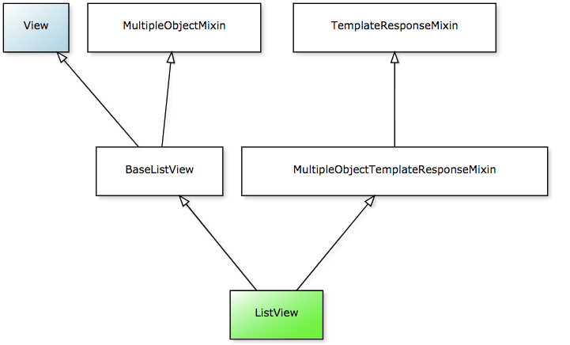

Open Source Example: ListView
-----------------------------

**django-timepiece/timepiece/contracts/views.py**

.. code-block:: python

  @cbv_decorator(permission_required('contracts.add_entrygroup'))
  class ListInvoices(SearchListView):
      model = EntryGroup
      paginate_by = 20
      search_fields = ['user__username__icontains',
                       'project__name__icontains',
                       'comments__icontains',
                       'number__icontains']
      template_name = 'timepiece/invoice/list.html'

      def get_queryset(self):
          qs = super(ListInvoices, self).get_queryset()
          return qs.order_by('-end', '-id')

Conclusion: ListView
--------------------

Beyond Generic Views
====================

Goat Detail Page
----------------

**project/goats/views.py**

.. code-block:: python

  class GoatDetailView(generic.DetailView):
    """See a single goat."""

    model = Goat
    template_name = "goats/goat_detail.html"

.. newslide::

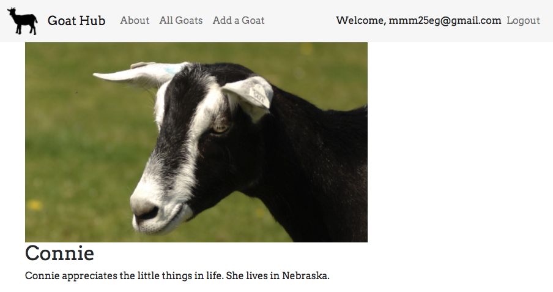

.. newslide::

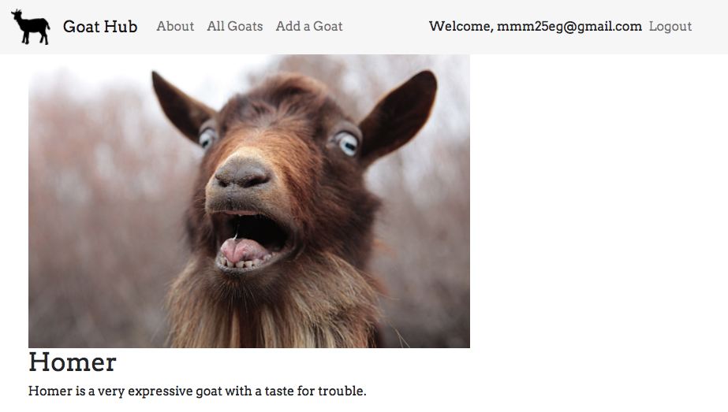

DetailView with Comments
------------------------

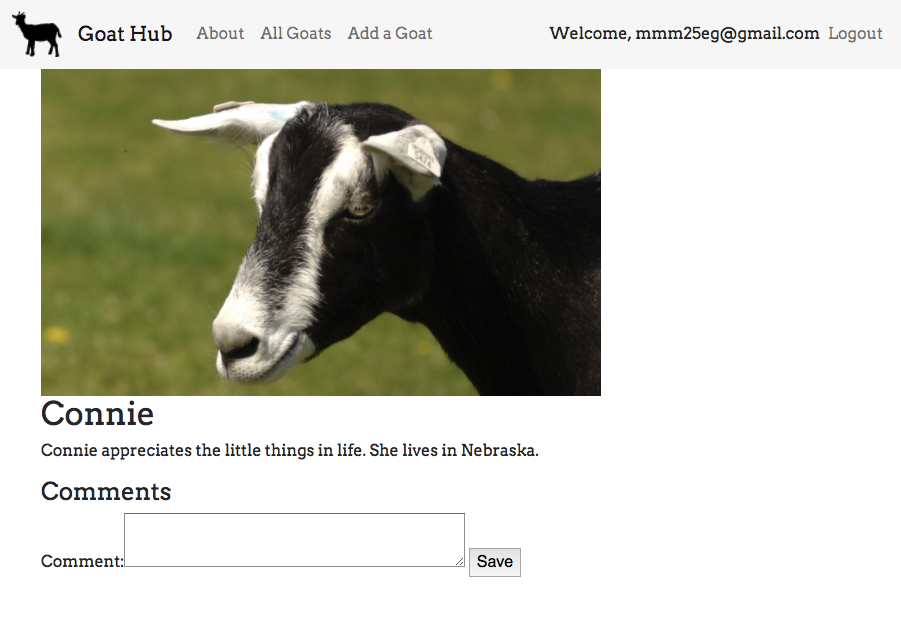

.. newslide::

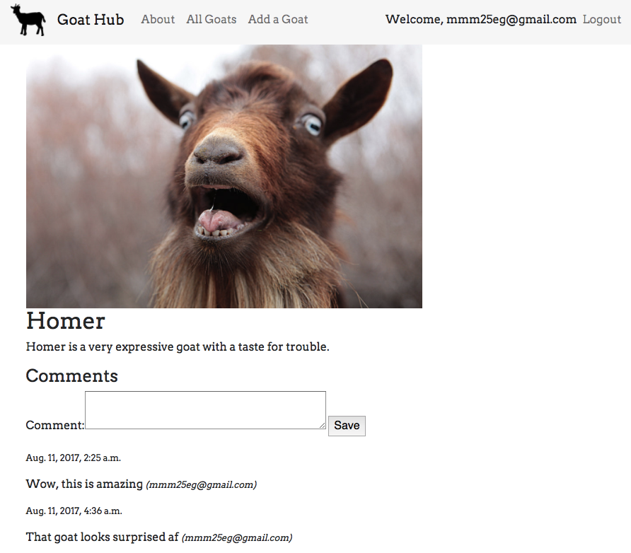

.. newslide::

**project/goats/models.py**

.. code-block:: python

  from django.db import models
  from django.contrib.auth.models import User
  from model_utils.models import TimeStampedModel, StatusModel

  class Comment(TimeStampedModel, models.Model):
      """A comment about a goat."""

      user = models.ForeignKey(
          User,
          null=False,
      )

      goat = models.ForeignKey(
          Goat,
          null=False,
      )

      comment = models.TextField(
          null=False,
      )

.. newslide::

**project/goats/forms.py**

.. code-block:: python

  from django.forms import ModelForm
  from .models import Comment

  class CommentCreateForm(ModelForm):
      """A form to create comments"""

      class Meta:
          model = Comment
          fields = ('comment',)

.. newslide::

**project/goats/views.py**

.. code-block:: python

  from forms import CommentCreateForm

  class CommentCreateFormMixin(object):
      """Mixin to add a comment box to GoatDetail page."""

      def post(self, request, *args, **kwargs):
          form = CommentCreateForm(request.POST)
          comment = form.save(commit=False)
          comment.goat = self.get_object()
          comment.user = self.request.user
          form.save()
          return HttpResponseRedirect(request.path)

      def get_context_data(self, **kwargs):
          context = super(CommentCreateFormMixin, self).get_context_data(**kwargs)
          context['comment_form'] = CommentCreateForm()
          return context

  class GoatDetailView(CommentCreateFormMixin, generic.DetailView):
      """See a single goat."""

      model = Goat
      template_name = "goats/goat_detail.html"

.. newslide::

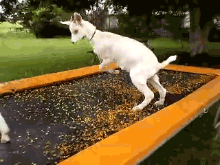

Conclusion
==========

Tips on Learning CBVs
---------------------

.. container:: nest-incremental

  - Try all the generic views first.

  - When you're lost, look around.

    - ``import pdb; pdb.set_trace()``

.. newslide::

.. container:: nest-incremental

  - **In Django, there is often a *right* way to do most things.**

    - Pursue the *right* way!

    - It often takes longer (at first).

    - It will teach you things.

Resources
---------

Django Braces

- https://django-braces.readthedocs.io/

Django Model Utils

- https://django-model-utils.readthedocs.io/en/latest/

Two Scoops of Django

- https://www.twoscoopspress.com/

Classy Class-Based Views

- https://ccbv.co.uk/

Special Thanks
--------------

- Joel Burton

- Hackbright Academy for sending me to PyBay

- Goats everywhere

Contact Me
----------

- Github: https://github.com/mmahnken/goathub

- Twitter: **@megthedeveloper**

- Email: **meggie@hackbrightacademy.com**

- Interested in teaching at Hackbright? We're hiring instructors.