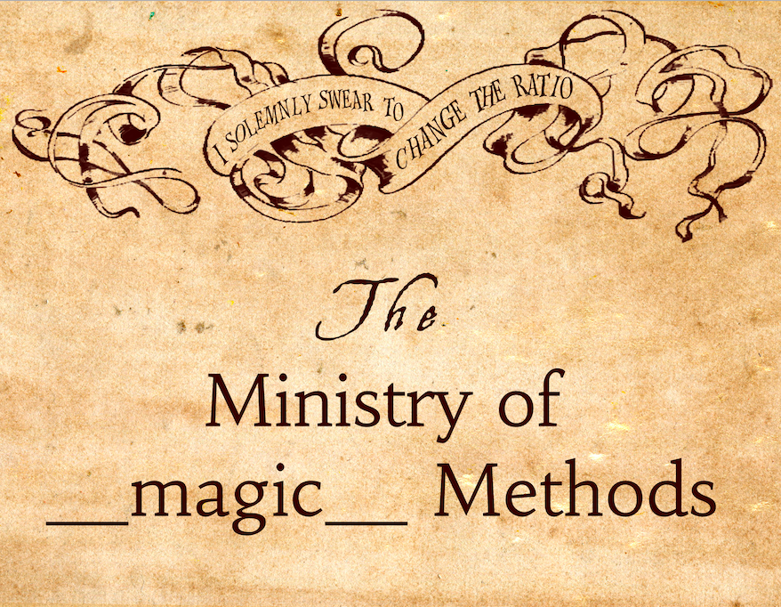
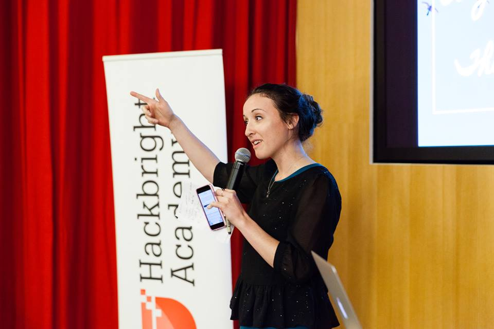

.. from talks today and tomorrow
  Brandon Rohdes talk on dicts
    OrderedDict.
    hashing as clobbering.
    key-sharing-- frozen set are __dict__keys.

================================================
Using `__slots__` for More Opinionated Objects
================================================

Intro
=====

I Love Magic Methods, etc.
--------------------------

Me at PyCon Last Year
---------------------

Dictionaries
============

Dictionaries
------------
Fast, Heavy

.. newslide::

.. parsed-literal::
    :class: big

    cat_facts = {"fur_color": "black",
                 "fav_hobby": "snoozing"}

.. jdigraph:: list
    :revealjs: -Grankdir=TB
    :handouts: -Grankdir=TB -Gsize=4,2
    :latex: -Grankdir=TB -Gsize=4,2

    mem [shape=plaintext label=<
    <TABLE BORDER="0" CELLBORDER="1" CELLSPACING="0" CELLPADDING="7"><TR>
      <TD><B>DICT</B> <I>nitems = 2</I></TD>
      <TD PORT="f0">#0</TD>
      <TD PORT="f1">#1</TD>
      <TD PORT="f2">#2</TD>
      <TD PORT="f3">#3</TD>
      <TD PORT="f4">#4</TD>
      <TD PORT="f5">#5</TD>
      <TD PORT="f6">#6</TD>
      <TD PORT="f7">#7</TD>
      <TD PORT="f8">#8</TD>
      <TD PORT="f9">#9</TD>
    </TR></TABLE>>]
    fur_color [shape=Mrecord label="'fur_color'|'black'"];
    fav_hobby [shape=Mrecord label="'fav_hobby'|'snoozing'"];
    mem:f7 -> fur_color;
    mem:f4 -> fav_hobby;

.. container:: nest-incremental

  - Hash keys, store hash key/value pair

  - Providing direct access via hashing takes up space

    - Associative array for attaching hash to key/value pair

    - Dictionaries in Python <3.6 have empty slots

Objects
=======

Objects Store Their Attributes in Dictionaries
----------------------------------------------

.. code-block:: python

    class Cat(object):
        """A cat."""

        def __init__(self, fur_color):
            self.fur_color = fur_color

.. container:: one-incremental

  ::

    >>> salem = Cat('black')
    >>> salem.fav_hobby = 'snoozing'
    >>> salem.__dict__
    {'fur_color': 'black', 'fav_hobby': 'snoozing'}

When is this not cool?
----------------------

It's like living in a mansion when you only |reveal-br|
have a sleeping bag.

``__slots__``
=============

Using ``__slots__`` with our Cat
--------------------------------

.. code-block:: python

  class FurCat(object):
      """A lighter cat."""

      __slots__ = ('fur_color',)

      def __init__(self, fur_color):
          self.fur_color = fur_color

.. container:: one-incremental

  ::

    >>> salem = FurCat('black')

.. container:: one-incremental

  ::

    >>> salem.fav_hobby = True
    Traceback (most recent call last):
      File "<stdin>", line 1, in <module>
    AttributeError: 'FurCat' object has no attribute 'fav_hobby'

.. container:: one-incremental

  Worth it. 

Why use ``__slots__``?
----------------------

.. container:: one-incremental

    When you don't want to internally store instance |reveal-br|
    attributes as a dictionary.

.. newslide::

When you know your object will need only a |reveal-br|
**particular set of attributes**,  |reveal-br|
and no more than that in its lifetime. |reveal-br|

Warning: Premature Optimization
-------------------------------

  "Don’t prematurely optimize and use this everywhere!
  [...]it really only saves you when you have **thousands** 
  of instances."

  - Ben Hoyt (http://tech.oyster.com/save-ram-with-python-slots/)

.. Warning: Inheritance
.. --------------------

.. Children of parent classes that have `__slots__` |reveal-br|
.. also can't add instance attributes.

What about Python 3.6?
----------------------

.. container:: item-incremental

  - Yes-- the Python 3.6 dictionary more efficiently uses space 

    - And maintains order

  - But, `__slots__` is still relevant

    - Paraphrasing Brandon Rhodes after his talk today

  - In 3.6, classes not using `__slots__` take up 4X as much space

    - Paraphrasing Aaron Hall during his talk today

Thanks
======

Me
--

I teach Python (and more) in SF at Hackbright Academy, |reveal-br|
a software engineering bootcamp for women.

.. container:: one-incremental

  - meggie@hackbrightacademy.com

  - Mentor? Educator? Student? Hiring Python devs?

  - https://hackbrightacademy.com

