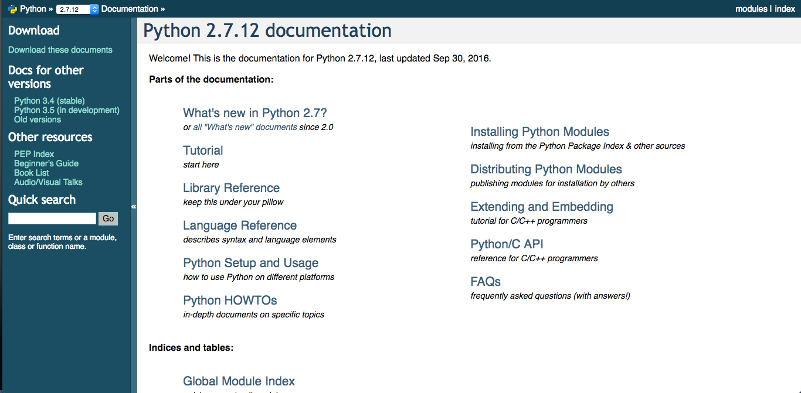
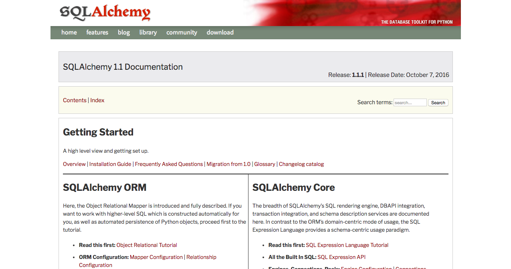
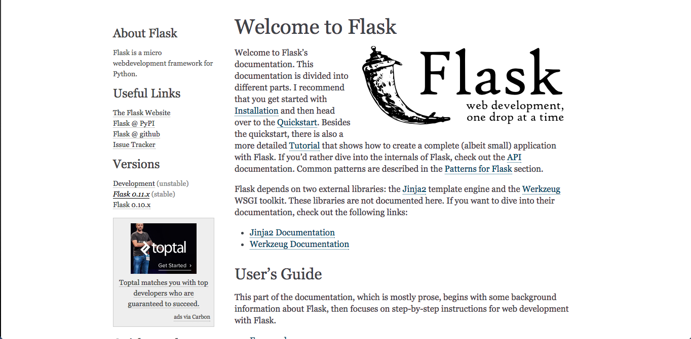
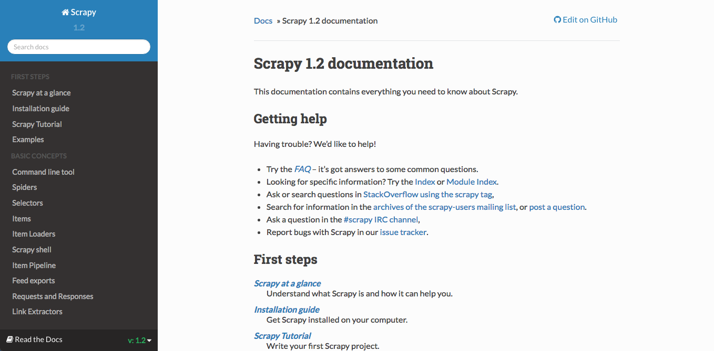
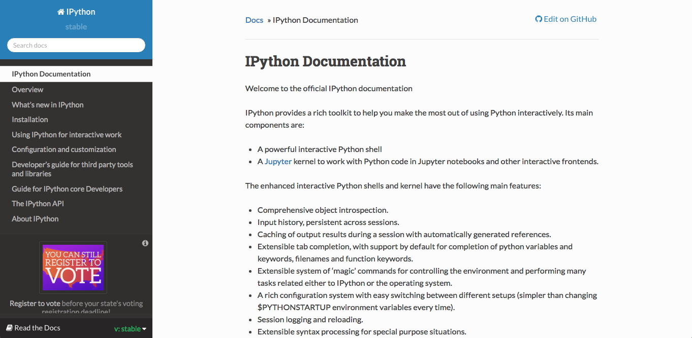
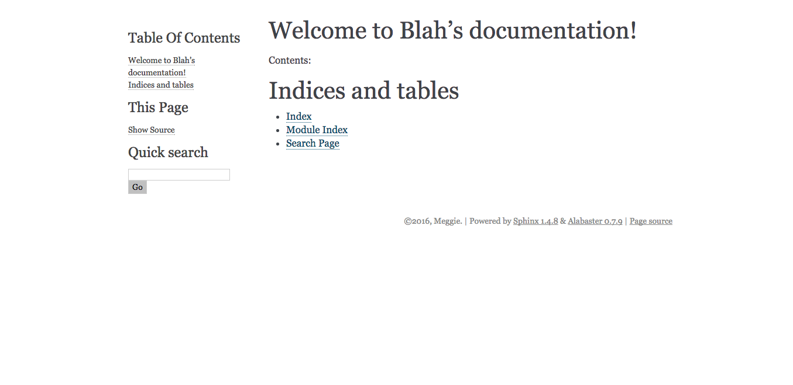
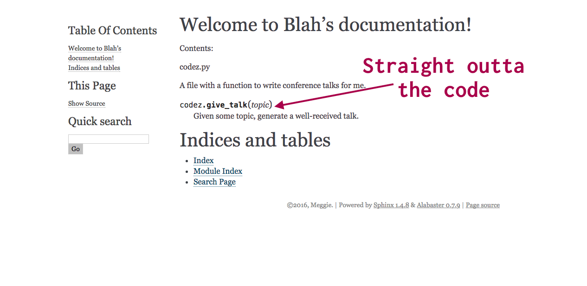

===================================================================================
"The Docs Are Amazing": Using Sphinx to auto-document software, and other stuff too
===================================================================================

About this talk
===============

What is documentation?
----------------------
.. container:: item-incremental

    - Text or illustration that accompanies software including information such as
      **requirements**, **architectural and design details**, and descriptions of 
      **algorithms** and **APIs** that the software implements.

    - For users

    - For other developers trying to contribute to the project/product

    - For other developers trying to use the project/product

.. speaker-notes

  Takes many forms: Tutorial, instructions, a sad text file that only you read

What makes documentation "amazing" ?
------------------------------------

.. container:: item-incremental

  - It's there

  - It's accurate

.. speaker-notes
  
  Don't have to name names, but how many of you have encountered documentation 
  that sucked?
  
  Amazing documentation?

  I work at Hackbright, students read docs, some docs are lauded, others are 
  ... made fun of. 

Goals of This Talk
------------------

.. container:: nest-incremental

  - Introduce Sphinx, and some of it's features

    - How can Sphinx ensure that you or your team **create**, and consistently **update**
      and **ship** documentation for the software that you're writing?

  - Discuss how my team at Hackbright Academy uses Sphinx to build educational components

    - How can **educators** leverage **software tools** like Sphinx, along with 
      version control, to create an engaging, up-to-date curriculum that can 
      exist in multiple formats?

.. newslide::

.. image:: shocked-cat.gif

Getting Started with Sphinx
===========================

What is Sphinx?
---------------

- a tool for creating documentation

- popular among the Python community, but other languages (programming 
  and markup) are also supported

.. newslide::

.. newslide::

.. newslide::

.. newslide::

.. newslide::

Getting Started
---------------

Pick a project to document. Go into its directory. |reveal-br|
Make a new directory called ``docs``.

.. parsed-literal::
  :class: console

  $ `cd YOURPROJECT`:cmd:
  $ `mkdir docs`:cmd:
  $ `cd docs`:cmd:

.. newslide::

Get into a virtual environement, and get Sphinx.

.. parsed-literal::
  :class: console

  $ `pip install Sphinx`:cmd:
  Collecting Sphinx
  Using cached Sphinx-1.4.8-py2.py3-none-any.whl
  ...
  Successfully installed Jinja2-2.8 MarkupSafe-0.23 Pygments-2.1.3
  Sphinx-1.4.8 alabaster-0.7.9 babel-2.3.4 docutils-0.12 imagesize-0.7.1
  pytz-2016.7 six-1.10.0 snowballstemmer-1.2.1

.. newslide:: 

.. parsed-literal::
  :class: console

  $ `sphinx-quickstart`:cmd:
  Welcome to the Sphinx 1.4.8 quickstart utility.

  Please enter values for the following settings (just press Enter to
  accept a default value, if one is given in brackets).

  Enter the root path for documentation.
  > Root path for the documentation [.]:

Tips for the Quickstart
-----------------------

- Say yes to the Makefile

- Say yes to the extension called ``autodoc``

Before/After the Quickstart
---------------------------
::

  yourproject/
    codez.py
    moar_codez.py
    docs/
|rarr|
:: 
  
  yourproject/
    codez.py
    moar_codez.py
    docs/
      Makefile
      _build/
      _static/
      _templates/
      conf.py
      index.rst
      make.bat

Let's see the docs!
-------------------

.. parsed-literal::
  :class: console

  $ `make html`:cmd:
  sphinx-build -b html -d _build/doctrees   . _build/html
  Running Sphinx v1.4.8
  loading pickled environment... done
  building [mo]: targets for 0 po files that are out of date
  building [html]: targets for 0 source files that are out of date
  updating environment: 0 added, 0 changed, 0 removed 
  looking for now-outdated files... none found
  no targets are out of date.
  build succeeded.

  Build finished. The HTML pages are in _build/html.
  $ `open _build/html/index.html`:cmd:

.. newslide::
  

Start Writing
-------------

.. container:: item-incremental

  - add to the file **index.rst** to change the homepage

  - add new files and link from **index.rst**

  - reStructuredText is the default markup language

  - provide easy code snippets and other helpful styling

  - run the command ``make html`` to see the result

This is cool!
-------------

Out of the box, Sphinx provides a sane framework for |reveal-br| converting
markup into a friendly documentation website.

.. container:: item-incremental

  - Yes! You can customize the template/homepage!

  - Yes! You can link to other pages and format code

  - There is a search! And a table of contents! 

.. container:: one-incremental

  But there's more...

.. speaker-notes
  Thinking back to what makes amazing documentation-- it is there, and
  it is accurate. We have something that is "there"!

Autodoc
=======

Docstrings in Python
--------------------

.. code-block:: python
  :emphasize-lines: 4
  
  import internet

  def give_talk(topic):
      """Given some topic, generate a well-received talk."""

      talk = set()

      results = internet.search(topic)
      for result in results:
         if result.relevant:
             talk.add(result)

      better_talk = add_jokes(talk)
      return better_talk

Tell Sphinx Where to Look
-------------------------

.. container:: compare

    .. container::

      In **conf.py**

      .. code-block:: python
        :emphasize-lines: 10

        # If extensions (or modules to document with 
        # autodoc) are in another directory,
        # add these directories to sys.path here. If 
        # the directory is relative to the
        # documentation root, use os.path.abspath to 
        # make it absolute, like shown here.
        #
        import os
        import sys
        sys.path.insert(0, os.path.abspath('..')) 
    
    .. container::

        In **index.rst**

        .. code-block:: rst
          :emphasize-lines: 9-10

          Welcome to Blah's documentation!
          ================================

          Contents:

          .. toctree::
            :maxdepth: 2

          .. automodule:: codez
            :members:

Et voila!
---------

Building a Course Curriculum Using Sphinx 
=========================================

Hackbright Academy
------------------

- Where I work

- We teach Python, Javascript, SQL, SQLAlchemy, Flask, HTML, CSS, PostgreSQL, 
  and more.

Our Curriculum is a Beast
-------------------------

.. container:: nest-incremental

    - We give 72 lectures over the course of our 10-week program.

      - Plus nightly and weekend homework

      - And lab exercises

      - All of these things require markup (rST files) and code materials (python files),
        and sometimes more.

    - Thank goodness for git, GitHub, and Sphinx.

Lectures at Hackbright
----------------------

- An **index.rst** that contains the content of the lecture

- Printable handouts for students to take notes

- Slides (that look a lot like this presentation) to present 

What was that Makefile?
-----------------------

::

    # Makefile for Sphinx documentation
    #

    # You can set these variables from the command line.
    SPHINXOPTS    =
    SPHINXBUILD   = sphinx-build
    BUILDDIR      = _build

    # Internal variables.
    ...
    ALLSPHINXOPTS   = -d $(BUILDDIR)/doctrees $(PAPEROPT_$(PAPER)) $(SPHINXOPTS) .

    ...

    html:
    $(SPHINXBUILD) -b html $(ALLSPHINXOPTS) $(BUILDDIR)/html
    @echo
    @echo "Build finished. The HTML pages are in $(BUILDDIR)/html."

Our Makefiles for Lectures
--------------------------

.. code-block:: bash
  :emphasize-lines: 18-19, 22-23

    revealjsi:
        $(SPHINXBUILD) -b revealjs $(ALLSPHINXOPTS) $(BUILDDIR)/revealjs

    revealjs: revealjsi
        @echo
        @echo "Build finished. The slides are in $(BUILDDIR)/revealjs."
        @open $(BUILDDIR)/revealjs/index.html

    handoutsi:
        $(SPHINXBUILD) -b handouts $(ALLSPHINXOPTS) $(BUILDDIR)/handouts

    handouts: handoutsi
        @echo
        @echo "Build finished. The HTML pages are in $(BUILDDIR)/handouts."
        open $(BUILDDIR)/handouts/index.html

    upload: handoutsi revealjsi demozip
        ssh $(SSH_HOST) rm -rf $(SSH_DIR)$(NAME)
        scp -r _build/handouts $(SSH_HOST):$(SSH_DIR)$(NAME)
        if [ -d *-demo* ]; then scp /tmp/$(NAME).zip $(SSH_HOST):$(SSH_DIR); fi
        open $(SSH_URL)$(NAME)
        ssh $(SSH_HOST) rm -rf $(SSH_DIR_SLIDE)$(NAME)
        scp -r _build/revealjs $(SSH_HOST):$(SSH_DIR_SLIDE)$(NAME)
        open $(SSH_URL_SLIDE)$(NAME)
        rm -f /tmp/$(NAME).zip
        rm -rf $(BUILDDIR)/*

In Closing
==========

Learn rST
---------

- reStructuredText

  - http://www.sphinx-doc.org/en/stable/rest.html#rst-primer

Things I didn't talk about
--------------------------

- epub support in Sphinx

- translating autogenerated text into another language (!)

Helpful Links
-----------------

- showing code in Sphinx http://www.sphinx-doc.org/en/stable/markup/code.html

- the best tutorial I could find to get started with Sphinx  http://gisellezeno.com/tutorials/sphinx-for-python-documentation.html

Thank you
---------

Thanks GDG, and thanks to all the organizers of this conference.

- Follow me on twitter @megthedeveloper
- My email is mmm25eg@gmail.com
